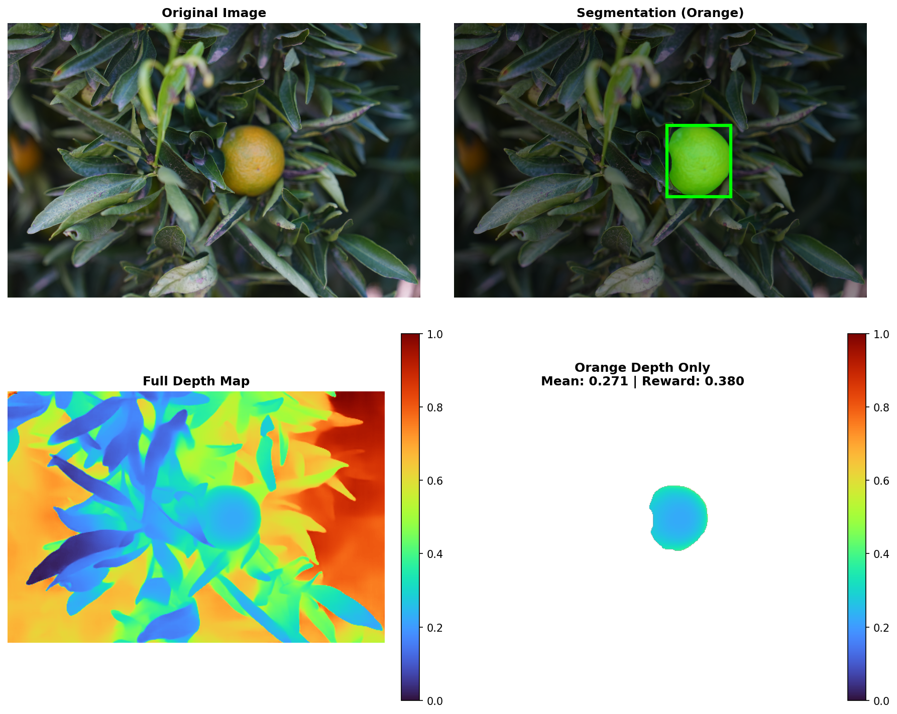

# SegDepthFusion

A high-performance, real-time segmentation and depth estimation pipeline designed for high-end NVIDIA GPUs. This project seamlessly integrates **SAM 3 (Segment Anything Model 3)** and **Depth Anything V3** to provide instance-aware depth maps.



## Features

- **Real-time Processing**: Optimized for high-throughput inference.
- **Instance-Aware Depth**: Combines semantic masks from SAM 3 with metric depth from Depth Anything 3.
- **Automated Setup**: One-click environment configuration for complex dependencies (PyTorch + Local Packages).
- **Screen Capture Integration**: Built-in support for real-time screen inference.

## Installation

> **Note**: This project requires Windows 11 and an NVIDIA GPU with CUDA 12.x support.

### 1. Clone the Repository
Ensure you clone with submodules to get the core model architectures:
```bash
git clone --recursive https://github.com/Lloyd-lei/SegDepthFusion.git
cd SegDepthFusion
```

### 2. One-Click Setup (PowerShell)
We provide an automated script to handle PyTorch versions and local package compilation.

Run this command in PowerShell:
```powershell
powershell -ExecutionPolicy Bypass -File auto_setup.ps1
```

This script will:
1. Create a Conda environment named `seg_depth_auto` (Python 3.11).
2. Install PyTorch, TorchVision, and xformers compatible with your GPU.
3. Install general dependencies (`numpy`, `cv2`, etc.).
4. Compile and install local `sam3` and `Depth-Anything-3` modules.

### 3. Activate Environment
```powershell
conda activate seg_depth_auto
```

## Usage

### Quick Test
Verify your installation and model loading with the included test script:
```bash
python quick_test.py
```

### Run Pipeline on Images
Process a folder of images to generate segmentation + depth visualizations:
```bash
python test_pipline.py --folder orange_photos
```
Results will be saved to the `outputs/` directory.

### Real-time Main Loop
To run the main real-time processing loop (configurable via `config.yaml`):
```bash
python main.py
```

## Directory Structure
```text
seg_depth/
├── auto_setup.ps1          # Installation automation script
├── config.yaml             # Pipeline configuration
├── main.py                 # Real-time application entry point
├── test_pipline.py         # Batch image processing script
├── quick_test.py           # Installation verification
├── sam3_model.py           # SAM 3 Model Wrapper
├── da3_model.py            # Depth Anything 3 Model Wrapper
├── seg_depth_pipeline.py   # Core logic combining Seg + Depth
├── orange_photos/          # Test images directory
├── Depth-Anything-3/       # [Submodule] Depth Anything V3 source
└── sam3/                   # [Submodule] SAM 3 source
```

## Troubleshooting

- **`gsplat` Warning**: You may see a warning about `gsplat` missing. This is optional for 3D rendering and does not affect the core pipeline.
- **`triton` Warning**: On Windows, `xformers` may warn about missing `triton`. This is normal (Linux-only feature) and safe to ignore.

## License
This project is based on [SAM 3](https://github.com/facebookresearch/sam3) and [Depth Anything](https://github.com/LiheYoung/Depth-Anything). Please refer to their respective repositories for license details.

